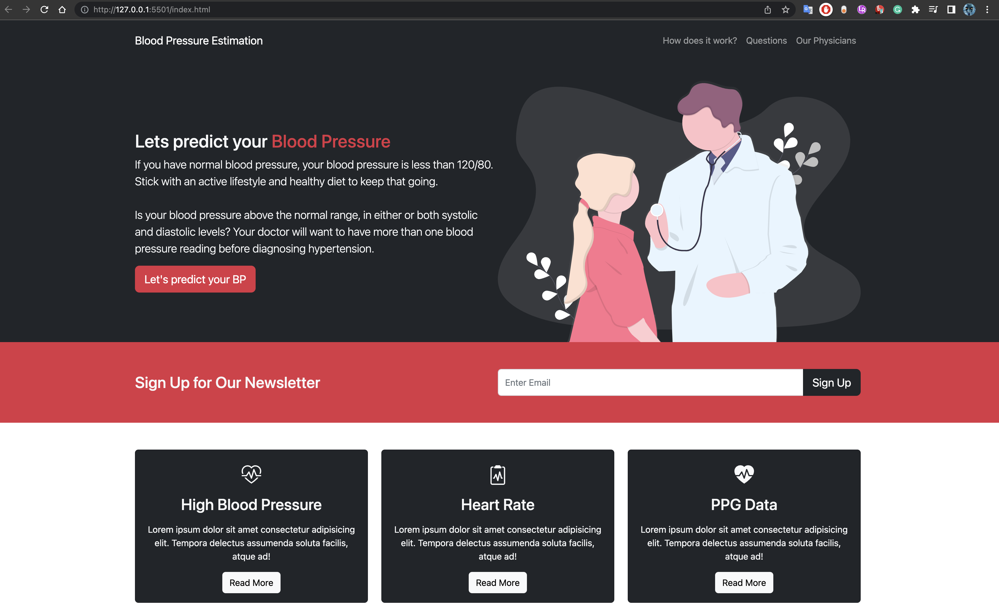
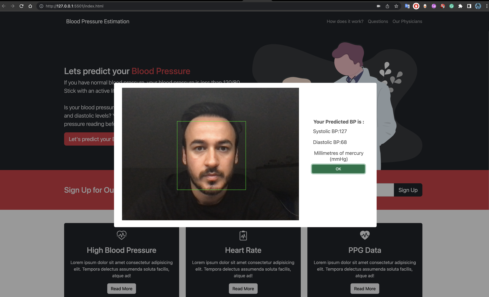

 

 

Folder description:

	-- MSc_DL_Model.ipynb : The file where I built and trained my DL models, data 
	   visualisation and data manipulation 
	-- app.py : The file where Flask framework used to connect both DL model and the website.
	-- model_5.h5 is the trained model with Adam optimization function
	-- heartbeat.js and index.js : The implementation for extracting rPPG signal
	-- index.html : The website

To execute this program, please follow these steps:

1- Begin by downloading the dataset from the provided link: [Dataset Link](https://drive.google.com/file/d/19MDJylakwdTKNS55zMpTtZX8PbYWNTkX/view?usp=sharing). Place the downloaded file into the Code folder, ensuring both files are in the same directory. Note that I had to remove the dataset from QM+ due to a 50 MB limitation.

2- Run the `app.py` file before launching the `index.html` file. In your terminal, execute the command: `python app.py`. Then, open the generated link by clicking on it. (It's important to mention that this webpage is not used for blood pressure estimation.)

3- If you're using Visual Studio Code, right-click on the `index.html` file and choose the "Open with Live Server" option. This will open the HTML file, allowing you to estimate your blood pressure by clicking the 'Let's predict your BP' button.

4- While the `app.py` is running, you can use the `index.html` file to measure your blood pressure.
   4.1- Ensure that you have the browser's Inspect tool open (preferably in Chrome). In the console of the Inspect tool, you'll see logs indicating that the website is running and successfully tracking your face.
   4.2- After approximately 10 seconds, your predicted blood pressure will appear in a pop-up menu once the webcam detects your face and remains stable.

If you require any assistance or guidance, feel free to reach out via email at enesbasbugeng@gmail.com.

Best regards,
Enes
